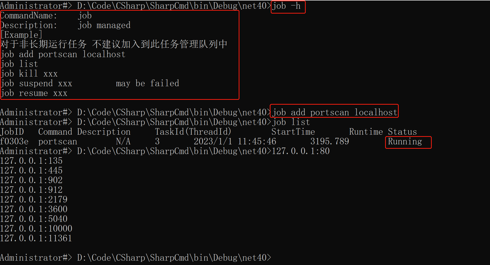
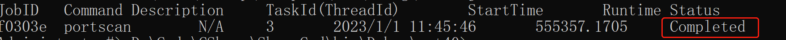
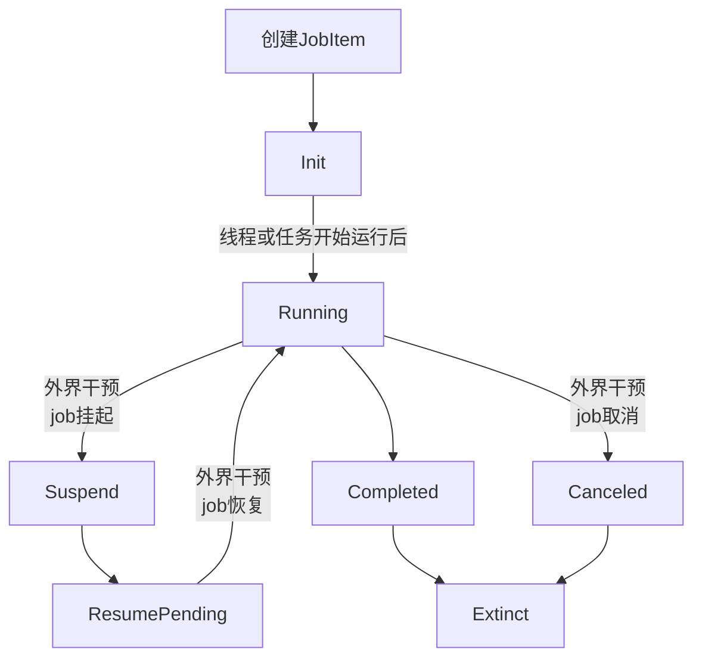

## Job

> 使用方式

> job -h 查看帮助
>
> job list 查看后台任务
>
> job kill 杀死任务   对于.NET4 使用Task Cancel取消功能 | .NET3.5 Thread采用 Abort终止线程功能 (若启动线程创建了其他线程执行任务无法终止这些线程)
>
> job suspend   .NET4使用事件同步    |  .NET3.5使用 Thread.Suspend
>
> job resume    .NET4使用事件同步    |  .NET3.5使用 Thread.Resume

> job list任务队列维护任务的运行状态     伪代码在下方



> 当任务结束后 再次查看任务




> 若任务执行中发生异常  Description域会记录异常Message,同时设置状态为 Exception


> 对于某些耗时操作 提供任务管理
>
> job list
>
> job add portscan  // 耗时操作
>
> job kill  jobId
>
> job suspend jobId
>
> job resume jobId

> 上面的输出操作即是外界干预，例如 输入job kill  即取消任务事件发生，随机对应的任务状态从运行时更改为取消
>
> 对于Init,Suspend,ResumePending状态到Canceled的过渡默认不被允许，默认认定挂起任务用户期待未来会运行




> 任务的执行状态

```c#
internal enum JobStatus
    {
        /// <summary>
        /// 任务初始化
        /// </summary>
        Init,
        /// <summary>
        /// 任务运行中
        /// </summary>
        Running,
        /// <summary>
        /// 任务挂起
        /// </summary>
        Suspend,
        /// <summary>
        /// 任务预恢复
        /// </summary>
        ResumePending,
        /// <summary>
        /// 任务取消
        /// </summary>
        Canceled,
        /// <summary>
        /// 任务完成
        /// </summary>
        Completed,
        /// <summary>
        /// 发生异常
        /// </summary>
        Exception,
        /// <summary>
        /// NotSupport
        /// </summary>
        NotSupport,
        /// <summary>
        /// 任务死亡
        /// </summary>
        Extinct,
    }
```


> 此结构表示一个任务

```c#

    internal class JobItem
    {
        public string JobID { get; set; } = Guid.NewGuid().ToString().Substring(0,6);

        public string Command { get; set; }

        public string Description { get; set; } = "N/A";

        public DateTime StartTime { get; set; } = DateTime.Now;

        public double Runtime { get; set; }
#if NET35
        public Thread JobTask { get; set; }
#endif
#if NET40
        public Task JobTask { get; set; }

        /// <summary>
        /// Task 取消
        /// </summary>
        public CancellationTokenSource TokenSource { get; set; } = new CancellationTokenSource();

        public ManualResetEvent resetEvent { get; set; } = new ManualResetEvent(true);
#endif

        public JobStatus JobStatus { get; set; }
    }
```

